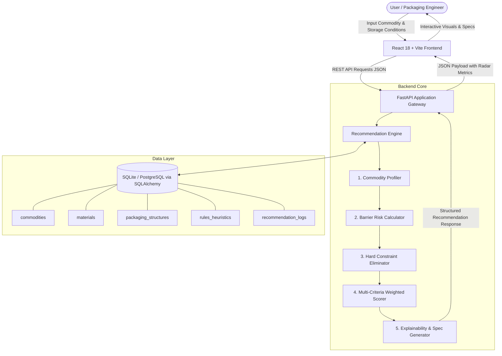
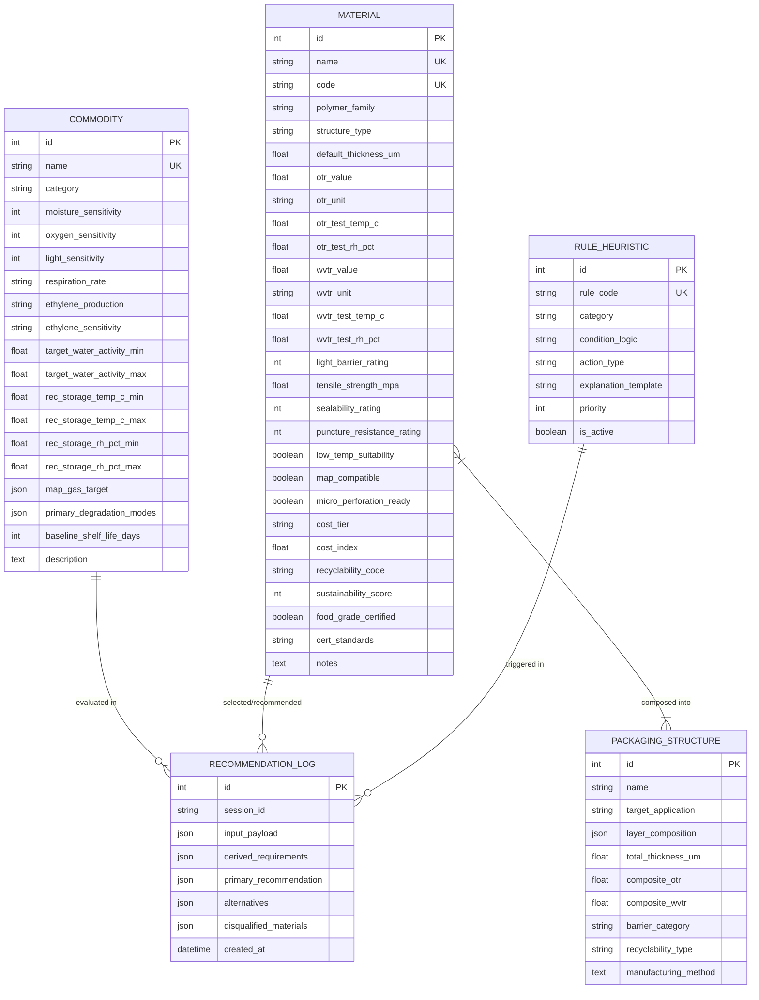
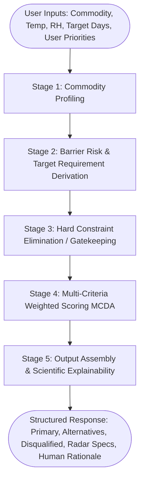

# PackWise AI — System Architecture & Technical Specification

## 1. System Overview

**PackWise AI** is a full-stack expert decision-support system designed to evaluate food commodity degradation pathways and recommend optimal, food-grade packaging materials, structures, and barrier specifications.



---

## 2. Database Schema Design

The database is built using SQLAlchemy ORM. It defaults to **SQLite** for development and is fully compatible with **PostgreSQL** for production deployment without code changes.

### 2.1 Entity Relationship Diagram



### 2.2 Table Definitions

#### Table: `commodities`
Stores intrinsic degradation characteristics, respiration physiological metrics, and storage tolerances.

| Column | Type | Constraints | Description |
|---|---|---|---|
| `id` | Integer | Primary Key, Auto-increment | Unique identifier |
| `name` | String(100) | Unique, Indexed, Non-null | Common commodity name (e.g., 'Banana', 'Potato chips') |
| `category` | String(50) | Non-null | Category: `Fresh Produce`, `Dry Crisp`, `High Fat Snack`, `Powder`, `Perishable Dairy`, `Frozen` |
| `moisture_sensitivity` | Integer | 1 to 5 (5 = ultra-sensitive) | Susceptibility to moisture uptake/loss |
| `oxygen_sensitivity` | Integer | 1 to 5 (5 = ultra-sensitive) | Susceptibility to oxidative degradation / rancidity |
| `light_sensitivity` | Integer | 1 to 5 (5 = ultra-sensitive) | Photodegradation / nutrient/color loss |
| `respiration_rate` | String(20) | Enum: `None`, `Low`, `Medium`, `High`, `Very High` | Metabolic respiration rate |
| `is_climacteric` | Boolean | Default False | Climacteric ripening behavior |
| `ethylene_production`| String(20) | `Low`, `Moderate`, `High`, `Very High` | Rate of ethylene gas emitted |
| `ethylene_sensitivity`| String(20) | `Low`, `Moderate`, `High` | Susceptibility to ethylene-induced ripening/decay |
| `target_water_activity_min` | Float | Nullable | Lower critical $a_w$ threshold |
| `target_water_activity_max` | Float | Nullable | Upper critical $a_w$ threshold |
| `rec_storage_temp_c_min` | Float | Non-null | Minimum recommended storage temperature (°C) |
| `rec_storage_temp_c_max` | Float | Non-null | Maximum recommended storage temperature (°C) |
| `rec_storage_rh_pct_min` | Float | Non-null | Minimum recommended storage relative humidity (%) |
| `rec_storage_rh_pct_max` | Float | Non-null | Maximum recommended storage relative humidity (%) |
| `map_gas_target` | JSON | Nullable | Recommended MAP atmosphere (e.g. `{"O2": 3, "CO2": 5, "N2": 92}`) |
| `primary_degradation_modes` | JSON | Non-null | List of key spoilage modes (e.g. `["Moisture Sorption", "Oxidation"]`) |
| `baseline_shelf_life_days` | Integer | Non-null | Typical unpackaged/standard shelf life in ambient conditions |
| `description` | Text | Nullable | Scientific notes and handling characteristics |

#### Table: `materials`
Stores polymer properties, standardized ASTM barrier measurements, mechanical attributes, and environmental profiles.

| Column | Type | Constraints | Description |
|---|---|---|---|
| `id` | Integer | Primary Key, Auto-increment | Unique identifier |
| `name` | String(100) | Unique, Indexed, Non-null | Material commercial / chemical name |
| `code` | String(20) | Unique, Indexed, Non-null | Standard code (e.g. `LDPE`, `BOPP`, `PET/EVOH/PE`) |
| `polymer_family` | String(50) | Non-null | Polyolefin, Polyester, Biopolymer, Multilayer Laminate, etc. |
| `structure_type` | String(50) | Non-null | `Monolayer`, `Co-extrusion`, `Laminate`, `Micro-perforated`, `Bio-film` |
| `default_thickness_um`| Float | Non-null | Standard gauge thickness in micrometers ($\mu\text{m}$) |
| `otr_value` | Float | Non-null | Oxygen Transmission Rate value |
| `otr_unit` | String(50) | Default: `cm3/(m2.24h.atm)` | OTR standardized unit |
| `otr_test_temp_c` | Float | Default: 23.0 | ASTM D3985 test temperature (°C) |
| `otr_test_rh_pct` | Float | Default: 0.0 | ASTM D3985 test relative humidity (%) |
| `wvtr_value` | Float | Non-null | Water Vapor Transmission Rate value |
| `wvtr_unit` | String(50) | Default: `g/(m2.24h)` | WVTR standardized unit |
| `wvtr_test_temp_c` | Float | Default: 38.0 | ASTM F1249 test temperature (°C) |
| `wvtr_test_rh_pct` | Float | Default: 90.0 | ASTM F1249 test relative humidity (%) |
| `light_barrier_rating` | Integer | 1 to 5 (5 = opaque/UV blocking) | Light & UV blocking capability |
| `tensile_strength_mpa` | Float | Non-null | Mechanical tensile strength (MPa) |
| `sealability_rating` | Integer | 1 to 5 (5 = excellent heat seal) | Hermetic seal strength & temperature window |
| `puncture_resistance_rating` | Integer | 1 to 5 | Resistance to sharp objects/flex cracking |
| `low_temp_suitability`| Boolean | Default False | Crack resistance at sub-zero (< -18°C) temperatures |
| `map_compatible` | Boolean | Default True | Compatibility with gas flushing / MAP machines |
| `micro_perforation_ready` | Boolean | Default False | Support for mechanical/laser micro-venting |
| `cost_tier` | String(20) | Enum: `Budget`, `Moderate`, `Premium`, `High` | Commercial cost classification |
| `cost_index` | Float | Non-null (1.0 = baseline LDPE) | Normalized relative cost multiplier |
| `recyclability_code` | String(20) | Nullable | RIC Resin ID Code (e.g. `Code 1 - PET`, `Code 4 - LDPE`, `Code 7 - Other`) |
| `sustainability_score`| Integer | 1 to 100 (100 = compostable/circular) | Eco-footprint and circular economy score |
| `food_grade_certified` | Boolean | Default True, Non-null | Non-negotiable safety flag |
| `cert_standards` | String(100) | Non-null | Compliance standards (e.g. `FDA 21 CFR 177, EU 10/2011, FSSAI`) |
| `notes` | Text | Nullable | Technical processing & usage observations |

---

## 3. Recommendation Engine Architecture

The recommendation engine executes a 5-stage deterministic pipeline:



### Stage 1: Commodity Profiling
Loads commodity attributes and evaluates environmental delta:
$$\Delta T = T_{\text{storage}} - T_{\text{optimal}}, \quad \Delta \text{RH} = \text{RH}_{\text{storage}} - \text{RH}_{\text{optimal}}$$
Calculates accelerated risk multipliers based on temperature Arrhenius approximations and moisture vapor pressure differentials.

### Stage 2: Barrier Risk & Target Requirement Derivation
Derives mathematical target thresholds:
- **Maximum Allowable OTR ($OTR_{\text{max}}$):**
  - If high oxygen sensitivity ($Sens_O \ge 4$) & high fat / lipid content: $OTR_{\text{target}} \le 2.0 \text{ cm}^3/(\text{m}^2\cdot\text{d}\cdot\text{atm})$.
  - If fresh produce ($Respiration \ge Medium$): Requires EMAP with $OTR \ge 800 - 3000$ or laser micro-perforations to avoid anoxia ($O_2 < 1.5\%$).
- **Maximum Allowable WVTR ($WVTR_{\text{max}}$):**
  - If high moisture sensitivity ($Sens_M \ge 4$) & dry crisp food ($a_w < 0.4$): $WVTR_{\text{target}} \le 1.5 \text{ g}/(\text{m}^2\cdot\text{d})$.
  - If frozen food: High puncture resistance + low temperature impact strength + low WVTR to prevent ice crystal sublimation (freezer burn).

### Stage 3: Hard Constraint Elimination (Gatekeeping)
Eliminates unsuitable candidates unconditionally:
1. **Food Grade Gate:** `if not material.food_grade_certified -> DISQUALIFY (Non-compliant food contact safety)`
2. **Fresh Produce Anoxia Gate:** If commodity is fresh produce and material is a hermetic zero-permeability barrier (e.g., Aluminum foil or high-barrier EVOH without perforation) $\rightarrow$ `DISQUALIFY (Risk of anaerobic fermentation, off-odors, and tissue collapse)`.
3. **Sub-Zero Brittleness Gate:** If storage temp $< 0^\circ\text{C}$ and `not material.low_temp_suitability` $\rightarrow$ `DISQUALIFY (Material subject to cold flex-cracking and seal shatter)`.
4. **Moisture Vulnerability Gate:** If commodity is dry crisp snack and material $WVTR > 10 \text{ g}/(\text{m}^2\cdot\text{d})$ $\rightarrow$ `DISQUALIFY (Moisture ingress will cause rapid loss of crispness within days)`.

### Stage 4: Multi-Criteria Weighted Scoring (MCDA)
Calculates composite suitability index for surviving materials:

$$S_{\text{total}} = w_b \cdot S_{\text{barrier}} + w_s \cdot S_{\text{sustainability}} + w_c \cdot S_{\text{cost}} + w_m \cdot S_{\text{mechanical}} + w_l \cdot S_{\text{shelf\_life}}$$

Where default weights $\sum w_i = 1.0$:
- Barrier Match ($w_b = 0.35$)
- Sustainability & Recyclability ($w_s = 0.20$)
- Cost Efficiency ($w_c = 0.20$)
- Mechanical & Seal Integrity ($w_m = 0.15$)
- Shelf-Life Extension ($w_l = 0.10$)

*Weights adjust dynamically based on user selection (`Balanced`, `Eco-First`, `Cost-First`, `Max-Protection`).*

### Stage 5: Output Assembly & Scientific Explainability
1. **Primary Recommendation:** Top-ranked material ($S_{\text{total}}$).
2. **Alternative Recommendations:**
   - **Eco-Choice:** Highest sustainability score among suitable materials.
   - **Budget-Choice:** Highest cost efficiency score among suitable materials.
   - **High-Barrier Choice:** Highest barrier score for extended logistics.
3. **Structured Explainability Output:**
   - *Core Rationale:* Why this polymer structure fits the commodity physiology.
   - *Risks Prevented:* Explicit spoilage modes addressed.
   - *Trade-offs:* Cost vs recyclability vs barrier performance notes.
   - *Disqualified Breakdown:* Exact scientific justification for eliminated materials.

---

## 4. API Endpoints Specification

Base URL: `/api/v1`

### 4.1 Commodity Endpoints
- `GET /commodities`: List all supported food commodities.
- `GET /commodities/{id}`: Detailed commodity profile with respiration and degradation metrics.

### 4.2 Material Endpoints
- `GET /materials`: List all packaging materials with ASTM barrier values and sustainability scores.
- `GET /materials/{id}`: Detailed material datasheet.

### 4.3 Recommendation Endpoints
- `POST /recommendations/analyze`: Core engine analysis endpoint.
  - **Request Body:**
    ```json
    {
      "commodity_id": 1,
      "custom_name": "Banana",
      "storage_temp_c": 13.5,
      "storage_rh_pct": 85.0,
      "target_shelf_life_days": 14,
      "package_format": "Pouch with vent",
      "priority_profile": "balanced",
      "custom_weights": {
        "barrier": 0.35,
        "sustainability": 0.25,
        "cost": 0.20,
        "mechanical": 0.20
      }
    }
    ```
  - **Response Body:**
    ```json
    {
      "commodity": { "id": 1, "name": "Banana", "category": "Fresh Produce" },
      "analysis_summary": {
        "respiration_risk": "Moderate-High (Climacteric)",
        "primary_degradation_modes": ["Anaerobic Fermentation", "Moisture Wilting", "Ethylene Decay"],
        "required_otr_range": "800 - 2500 cm3/(m2.24h.atm)",
        "required_wvtr_range": "15 - 30 g/(m2.24h)",
        "recommended_map_gas": "3-5% O2, 5-8% CO2, balance N2"
      },
      "primary_recommendation": {
        "material_id": 10,
        "name": "Breathable / Micro-Perforated Film",
        "code": "Perforated-LDPE",
        "recommended_thickness_um": 30.0,
        "total_score": 92.4,
        "scores_breakdown": {
          "barrier_score": 95.0,
          "sustainability_score": 85.0,
          "cost_score": 90.0,
          "mechanical_score": 88.0
        },
        "cost_tier": "Budget",
        "sustainability_score": 85,
        "map_suitability": "Ideal for EMAP",
        "explanation": "Micro-perforated film allows controlled oxygen replenishment matching banana respiration rate, preventing anaerobic ethanol production while maintaining humidity to prevent weight loss."
      },
      "alternatives": [
        {
          "type": "Eco Choice",
          "material_id": 9,
          "name": "PLA Biodegradable Film",
          "total_score": 84.1,
          "highlights": "Compostable biopolymer with natural high gas permeability."
        }
      ],
      "disqualified_materials": [
        {
          "material_id": 7,
          "name": "Aluminum Foil Laminate",
          "reason": "Eliminated: Zero gas permeability induces severe anaerobic respiration in fresh bananas, causing ethanol fermentation, physiological disorder, and tissue breakdown."
        }
      ],
      "disclaimer": "PackWise AI provides scientific engineering decision support. Final commercial packaging requires empirical shelf-life testing and validation."
    }
    ```

### 4.4 Shelf Life Estimation (Hook for Future ML)
- `POST /shelf-life/estimate`: Evaluates storage temperature kinetics and packaging barrier to estimate shelf-life days.

### 4.5 Health & Meta Endpoints
- `GET /health`: Health status, database connection state, and version.
- `GET /rules`: List all active expert rules in the decision system.

---

## 5. Frontend Architecture & Design System

### 5.1 Technology & Aesthetics
- **Core Framework:** React 18 with Vite build tool.
- **Styling:** Modern Tailwind CSS with custom design tokens (glassmorphism cards, emerald/teal eco accents, slate/indigo dark/light hierarchy, smooth micro-interactions).
- **Icons:** Lucide React icons.
- **Visuals & Charts:** Recharts (Radar charts for multi-dimensional barrier/cost/sustainability comparisons, Bar charts for sensitivity breakdowns).

### 5.2 Page & Route Structure
1. `/` — **Home / Overview:** Hero section, core value proposition, quick commodity explorer cards, interactive starter.
2. `/recommend` — **Recommendation Wizard:**
   - *Step 1:* Commodity selection & baseline degradation profile.
   - *Step 2:* Storage conditions (Temp slider, RH slider, target shelf life).
   - *Step 3:* Packaging format & user priority profiles (Balanced, Eco, Budget).
   - *Step 4:* Interactive Results Dashboard (Primary match, Radar benchmark, Alternatives, Disqualified reasons, Export report).
3. `/materials` — **Materials Catalog:** Filterable table with ASTM barrier metrics, polymer properties, recyclability codes, and compliance badges.
4. `/commodities` — **Commodity Knowledge Base:** Encyclopedia of food spoilage modes, respiration curves, and recommended MAP atmospheres.
5. `/compare` — **Material Comparison Matrix:** Side-by-side radar and tabular comparison between 2 to 4 packaging materials.
6. `/methodology` — **Science & Methodology:** Explainability standards, ASTM test procedures reference, and legal disclaimers.

---

## 6. Security, Compliance & Scalability

1. **Food Safety Gate:** Zero-tolerance rule for non-food grade materials.
2. **Extensible Database Engine:** SQLAlchemy enables seamless transition from SQLite to PostgreSQL with Alembic database migrations.
3. **Data Integrity:** Strict Pydantic v2 schemas enforce type safety and range validations across all API interactions.
4. **Modular Architecture:** The recommendation core is completely decoupled from web endpoints, allowing standalone CLI execution or automated batch testing.
